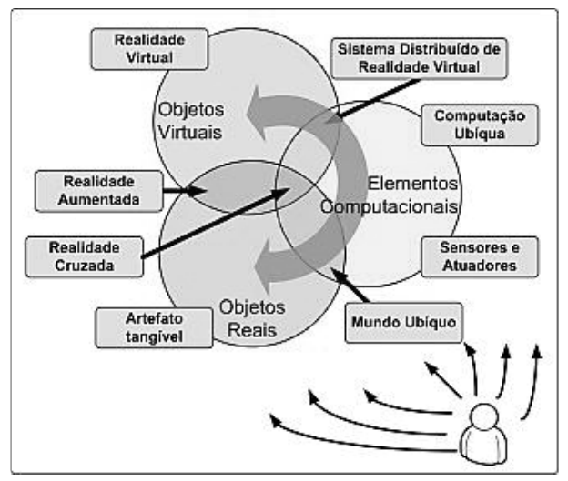
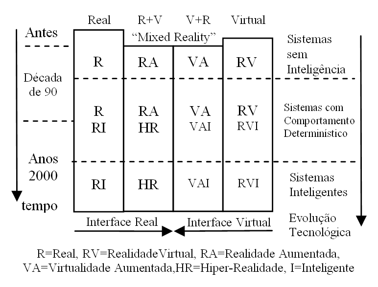
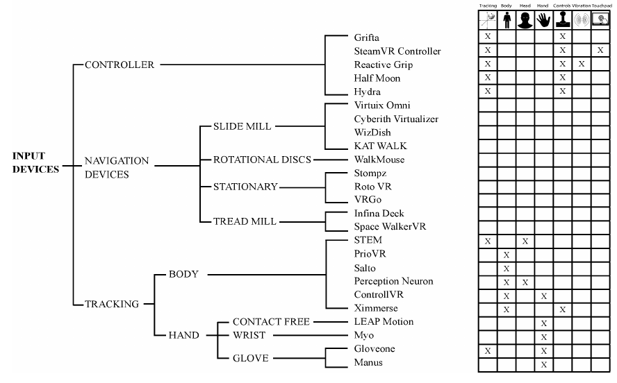
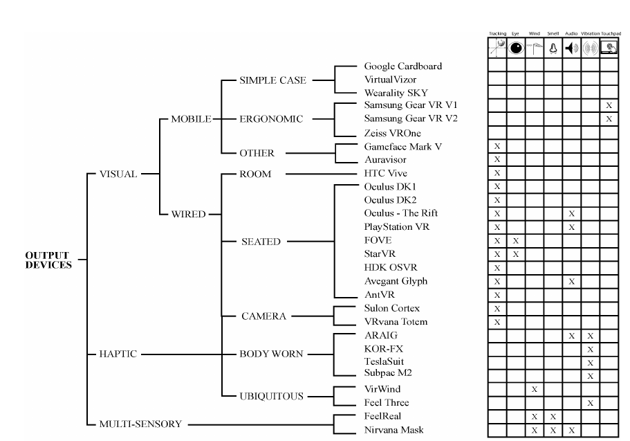

# Realidade Virtual e Realidade Aumentada

## Metodologia

### Bibliografia de base

Tendências e Técnicas em Realidade Virtual e Aumentada. v.4 maio/2014

Link: 

[hiperrealidade.com.br/ce-rv/new/](http://hiperrealidade.com.br/ce-rv/new/)

## Realidade Virtual (RV)

### Definição básica

Segundo Gimenez e Carlos Kirner:

> Realidade Virtual (RV) é uma técnica avançada de interface do usuário que permite realizar imersão, interação e navegação em um ambiente sintético tridimensional, gerado por computador, utilizando canais multisensoriais.

### História

- 1956: Morton Heilig inicia construção do ["Sensorama"](video/sensorama.mkv)

- 1961: Comeau e Bryan (Philco) criam capacete "Head-Mounted Display" 

- 1963: Ivan Sutherland [“Sketchpad](video/sketchpad.mp4), a Man-Machine Graphical Communication System” - Definição de Realidade Virtual

- 1968: Sutherland [“A Head-Mounted Three Dimensional Display”](video/head-mounted.mp4) - Marco com ideia de imersão

### Características

É classificada de acordo com os níveis de:

- Interação

- Imersão

- Navegação

**Obs: Existe RV não imersiva**

### Conceitos

> Realidade misturada (realidade e virtualidade aumentada), hiperrealidade(ou realidade cruzada)

### Conceitos

### Conceitos

## Realidade Aumentada (RA)

### Definição básica

Segundo Ronald Azuma:

> "Realidade Aumentada (RA) é uma variação da Realidade Virtual (também dito Ambiente Virtual). (...) Em contraste com a Realidade Virtual, a RA permite que o usuário veja o mundo real junto com objetos virtuais sobrepostos no mundo real. (..) Idealmente o usuário deveria se sentir num ambiente em que o virtual e real coexistam." (Livre tradução)

### História

- 1975: Myron Krueger cria um laboratório de realidade virtual chamado [“Videoplace”](video/videoplace.mp4), que permite o usuário interagir com elementos virtuais pela
primeira vez.

- 1990: Tom Caudell cunha o termo “Realidade Ampliada”, enquanto estava na Boeing, enquanto ajudava trabalhadores a montar cabos em aeronaves.

### Características

Azuma define 3 características fundamentais:

- Combinação do real com virtual

- Interação em tempo real

- Concebida em três dimensões

### Técnicas

> Tipos de sistemas:

- Visão ótica direta

- Visao direta por vídeo

- Visão por vídeo baseado em monitor

- Visão ótica por projeção

> Suportes:

- Marcadores (Hiro, QR-Code)

- Projetores

- Dispositivos móveis

- Monitores

## Exemplos 

### Exemplos

- [CAVE 2001](video/cave2001.webm)

- [CAVE 2016](video/cave2016.mkv)

- [Treinamento militar](video/RV-exercito.mp4)

- [Exército RA](video/exercito-ra.mkv)

- [Kinect em operações](video/RV-kinect-operacao.mp4)

- [Kinect em terapias de recuperação](video/RV-kinectTerapia.mp4)

- [Kinect jogo de quebra cabeça](video/RV-kinect-puzzle.mp4)

- [Jogo de xadrez captura de movimento](video/VirtualdadeAumentada-Xadrez.mp4)

- [Vídeo divulgação Google Glass](video/google-glass.mkv)

- [Pokemon Go](video/pokemon.mkv)

### Exemplos

- [RA marcador HIRO](video/RA-marcador-HIRO.mp4)

- [Brinde Japão RA](video/RA-japao.mkv)

- [Insta Stories](video/RA-stories.mp4)

- [Propaganda Discovery Chanel](video/RA-propaganda.mp4)

- [RA em evento de Tecnologia](video/RAAzuma_Leviathan.mp4)

- [Brinde Japão Holograma](video/holograma-japao.mkv)

- [Show do TUPAC](video/holografia-tupac.mkv)

- [Pai testando Oculus Rift](video/RV-OculusRift.mkv)

- [Mídia Tangível MIT](video/midia-tangivel.webm)

- [Série Hiperrealidade](video/hiperrealidade-serie.mkv)

- [Obra Campo Minado](video/campo-minado.mp4)

- [Evolução do IHC](video/evolucao-IHC.mkv)

## Área para Desenvolvedores

### Softwares

- ARToolkit

- AndAR

- GART

- Unity3D

- GestualJS

- openFrameworks

- [openCV](http://opencv.org/)

- [GoogleVR](https://developers.google.com/vr/?hl=en)

- [Mozilla VR](https://mozvr.com/)

### Hardwares

- [vuzix](https://www.vuzix.com/#1)

- Google Glass

- Microsoft Kinect

- Oculus Rift

## Listagem de dispositivos

### Entrada

### Saída

